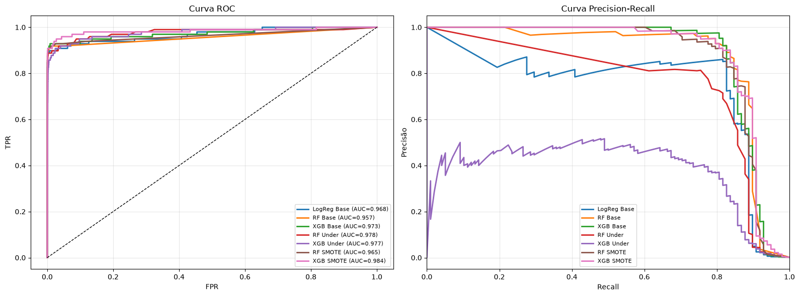
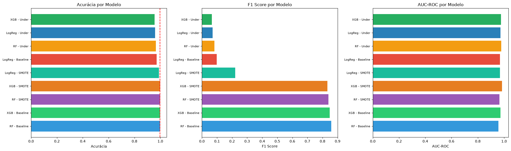
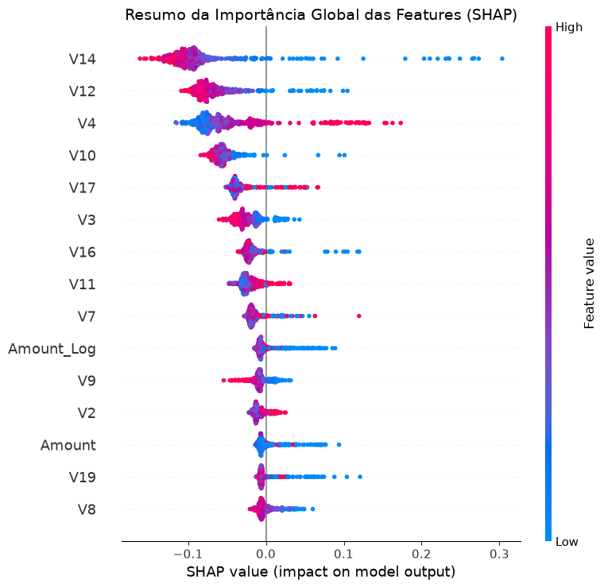

<div align="center">

# 🔍 Detecção de Fraude em Cartão de Crédito

### *Quando 99,8% de acurácia significa um modelo inútil*


**Pipeline completo de ML** — da exploração dos dados à explicação das predições com SHAP.

[](https://github.com)
[](https://colab.research.google.com/)

</div>

---

## 💡 O Problema

Imagine que você constrói um modelo que **nunca detecta nenhuma fraude** — ele chama tudo de "transação normal". Esse modelo teria:

```
✅ Acurácia:  99,83%    ← parece perfeito, não é?
✅ Precisão "visual": impressionante no dashboard
❌ Fraudes detectadas: 0 de 492
❌ Recall: 0%
❌ Utilidade prática: ZERO
```

> **A acurácia engana.** Em um dataset onde 99,83% das transações são normais, ela mede apenas o viés da classe majoritária.

### A métrica que realmente importa

| Métrica | Pergunta que responde | Por que importa |
|---------|----------------------|-----------------|
| **Recall** | De cada 100 fraudes, quantas o modelo pegou? | Fraude perdida = dinheiro perdido |
| **Precisão** | De cada 100 alertas, quantos são fraudes reais? | Falso alerta = cliente legítimo bloqueado |
| **F1-Score** | Harmonia entre precisão e recall | **Nossa métrica principal** |
| **AUC-ROC** | Capacidade de separar classes | Qualidade geral do ranking |

---

## 📈 Resultados Reais

> Métricas obtidas executando o notebook completo — **9 modelos comparados** no conjunto de teste (56.962 transações, 98 fraudes).

### 🏆 Ranking final por F1-Score (classe fraude)

```
 1. RF - Baseline    ████████████████████████████████████░░  0.857  ⭐ VENCEDOR
 2. XGB - Baseline   ███████████████████████████████████░░░  0.848
 3. RF - SMOTE       ██████████████████████████████████░░░░  0.839
 4. XGB - SMOTE      █████████████████████████████████░░░░░  0.832
 5. LogReg - SMOTE   ████████░░░░░░░░░░░░░░░░░░░░░░░░░░░░░  0.221
 6. LogReg - Base    ███░░░░░░░░░░░░░░░░░░░░░░░░░░░░░░░░░░  0.098
 7. RF - Under       ██░░░░░░░░░░░░░░░░░░░░░░░░░░░░░░░░░░░  0.083
 8. LogReg - Under   ██░░░░░░░░░░░░░░░░░░░░░░░░░░░░░░░░░░░  0.071
 9. XGB - Under      ██░░░░░░░░░░░░░░░░░░░░░░░░░░░░░░░░░░░  0.066
```

### Detalhamento completo

| # | Modelo | F1 | Precisão | Recall | AUC-ROC | Acurácia |
|---|--------|-----|----------|--------|---------|----------|
| 1 | **RF - Baseline** | **0,857** | **0,93** | 0,80 | 0,957 | 99,95% |
| 2 | XGBoost - Baseline | 0,848 | 0,87 | 0,83 | 0,973 | 99,95% |
| 3 | Random Forest - SMOTE | 0,839 | 0,85 | 0,83 | 0,965 | 99,95% |
| 4 | **XGBoost - SMOTE** | 0,832 | 0,81 | **0,86** | **0,984** | 99,94% |
| 5 | LogReg - SMOTE | 0,221 | 0,13 | 0,90 | 0,969 | 98,91% |
| 6 | LogReg - Baseline | 0,098 | 0,05 | 0,90 | 0,968 | 97,16% |
| 7 | RF - Undersampling | 0,083 | 0,04 | 0,92 | 0,978 | 96,52% |
| 8 | LogReg - Undersampling | 0,071 | 0,04 | 0,91 | 0,973 | 95,90% |
| 9 | XGBoost - Undersampling | 0,066 | 0,03 | 0,92 | 0,977 | 95,50% |
| — | *Dummy "sempre normal"* | *0,000* | *0,00* | *0,00* | *0,50* | *99,83%* |

### 📊 Curvas de avaliação (ROC e Precision-Recall)

<p align="center">
  
</p>

> **Esquerda — Curva ROC:** quanto mais colada no canto superior esquerdo, melhor. Todos os modelos ficam acima da linha tracejada (classificador aleatório).
>
> **Direita — Curva Precision-Recall:** a métrica que importa em fraude. Repare que os modelos com undersampling (vermelho/roxo) mantêm recall alto, mas a precisão despenca — é o trade-off clássico.

### 📊 Comparação geral dos modelos

<p align="center">
  
</p>

> Note como a **acurácia (esquerda)** é quase igual para todos — é por isso que ela engana. O **F1 (centro)** é que separa os modelos de verdade.

### 🎯 As descobertas mais interessantes

<details>
<summary><b>1. O undersampling pega quase toda fraude — mas dispara alarme em todo mundo</b></summary>

```
Recall: 92% ✅  (pega 9 de cada 10 fraudes)
Precisão: 3% ❌  (de 100 alertas, só 3 são fraude real)
```
> Descartar 99% dos dados normais faz o modelo "ver fraude em tudo". Gera **~2.800 falsos positivos** para cada verdadeiro positivo.
</details>

<details>
<summary><b>2. SMOTE é o melhor balanceamento para Regressão Logística</b></summary>

O F1 da LogReg saltou de **0,098 → 0,221** (+126%) com SMOTE, mas ainda muito atrás das árvores. A relação linear simples não captura a complexidade das fraudes.
</details>

<details>
<summary><b>3. XGBoost + SMOTE tem o MEIOR AUC-ROC (0,984)</b></summary>

Mesmo com F1 levemente menor que o Random Forest, o XGBoost ordena melhor as transações por risco — ideal para **priorizar investigações** quando o analista só consegue revisar N casos por dia.
</details>

<details>
<summary><b>4. class_weight='balanced' venceu o undersampling/SMOTE</b></summary>

O Random Forest com peso de classe ajustado (sem reamostragem) obteve o **melhor F1 (0,857)** mantendo todas as 284K transações disponíveis para aprendizado.
</details>

---

## 🗺️ Pipeline do Projeto

```
┌─────────────────────────────────────────────────────────────────┐
│  📊 EXPLORAR                                                    │
│  284.807 transações → 492 fraudes (0,17%) → verificação nulos   │
└──────────────────────────┬──────────────────────────────────────┘
                           ▼
┌─────────────────────────────────────────────────────────────────┐
│  🛠️ PREPARAR                                                    │
│  log(Amount) + log(Time) → StandardScaler → stratify 80/20      │
└──────────────────────────┬──────────────────────────────────────┘
                           ▼
┌─────────────────────────────────────────────────────────────────┐
│  ⚖️ BALANCEAR (3 abordagens testadas)                           │
│  • Baseline + class_weight='balanced'                           │
│  • Undersampling (RandomUnderSampler)                           │
│  • Oversampling (SMOTE)                                         │
└──────────────────────────┬──────────────────────────────────────┘
                           ▼
┌─────────────────────────────────────────────────────────────────┐
│  🤖 TREINAR (3 algoritmos × 3 balanceamentos = 9 modelos)       │
│  Logistic Regression → Random Forest → XGBoost                  │
└──────────────────────────┬──────────────────────────────────────┘
                           ▼
┌─────────────────────────────────────────────────────────────────┐
│  📏 AVALIAR                                                     │
│  F1 + Recall → curva ROC → curva Precision-Recall → threshold   │
└──────────────────────────┬──────────────────────────────────────┘
                           ▼
┌─────────────────────────────────────────────────────────────────┐
│  🔎 EXPLICAR                                                    │
│  Importância de features → SHAP summary → SHAP waterfall        │
└─────────────────────────────────────────────────────────────────┘
```

---

## 📂 O que tem dentro do notebook

**32 células · 11 seções · executado e validado (0 erros)**

| # | Seção | O que você aprende |
|---|-------|-------------------|
| 1 | Importar | Setup completo do ambiente |
| 2 | **Explorar** | Por que a distribuição 99,83/0,17 quebra a acurácia |
| 3 | **Preparar** | Feature engineering, scaling e o porquê do `stratify` |
| 4 | **Balancear** | Undersampling vs SMOTE — na prática, não na teoria |
| 5 | **Treinar** | Baseline vs reamostragem, 3 algoritmos |
| 6 | **Comparar** | Ranking por F1 (a acurácia está lá só para provar que engana) |
| 7 | **Curvas** | ROC e Precision-Recall lado a lado |
| 8 | **Threshold** | Ajustar o limiar de decisão para maximizar F1 |
| 9 | **Features** | Quais variáveis o modelo mais usa |
| 10 | **SHAP** | *"Por que ESTA transação foi marcada como fraude?"* |
| 11 | Conclusão | Lições aprendidas |

### 🔎 Prévia da explicabilidade (SHAP)

<p align="center">
  
</p>

> Cada ponto é uma transação. Quanto mais à direita, mais a feature empurra a decisão para **"fraude"**. As features `V14`, `V12` e `V10` são as maiores influenciadoras.

---

## 🚀 Como executar

```bash
# 1. Clone o repositório
git clone https://github.com/SEU-USUARIO/fraud-detection.git
cd fraud-detection

# 2. Ambiente virtual (recomendado)
python -m venv venv
source venv/bin/activate        # Linux/Mac
venv\Scripts\activate           # Windows

# 3. Instale as dependências
pip install -r requirements.txt

# 4. Baixe o dataset no Kaggle (grátis, ~150 MB)
#    👉 https://www.kaggle.com/datasets/mlg-ulb/creditcardfraud
#    Coloque o creditcard.csv na raiz do projeto

# 5. Abra o notebook
jupyter notebook fraud_detection.ipynb
```

> 💡 **Sem tempo para rodar?** O notebook já está **versionado com todos os outputs** — gráficos, tabelas e métricas visíveis direto no GitHub.

### Execução rápida sem ambiente virtual

```bash
pip install pandas numpy scikit-learn xgboost imbalanced-learn shap matplotlib seaborn jupyter
```

---

## 🧰 Stack

| Ferramenta | Versão | Papel no projeto |
|------------|--------|------------------|
|  | 3.14 | Linguagem |
| **pandas** | 3.0 | Análise de dados |
| **NumPy** | 2.4 | Transformações (`log1p`) |
| **scikit-learn** | 1.9 | Modelos, métricas, `StandardScaler`, `train_test_split` |
| **XGBoost** | 3.4 | Gradient Boosting |
| **imbalanced-learn** | 0.14 | `RandomUnderSampler`, `SMOTE` |
| **SHAP** | 0.52 | Explicabilidade (TreeExplainer) |
| **matplotlib / seaborn** | — | Visualizações |

---

## 📊 Dataset

| | |
|---|---|
| **Fonte** | [Kaggle — Credit Card Fraud Detection](https://www.kaggle.com/datasets/mlg-ulb/creditcardfraud) |
| **Transações** | 284.807 (setembro/2013, titulares europeus) |
| **Fraudes** | 492 (0,17%) |
| **Features** | `Time`, `Amount`, `Class` + `V1`–`V28` (anônimas via PCA) |
| **Licença** | CC BY-NC-SA 4.0 |

> 🔒 As colunas `V1`–`V28` passaram por **PCA** para proteger a identidade dos titulares — por isso não temos nomes como "valor", "estabelecimento" ou "país".

---

## 🔮 Ideias para evoluir

- [ ] `GridSearchCV` com busca ampliada de hiperparâmetros
- [ ] Features temporais (transações em sequência, janelas deslizantes)
- [ ] LightGBM e CatBoost no comparativo
- [ ] Detecção de anomalias não supervisionada (Isolation Forest)
- [ ] Curva de ganho/lift para simular o impacto financeiro
- [ ] Threshold por custo: `custo_falso_negativo >> custo_falso_positivo`

---

## 📄 Licença

Distribuído sob a licença **MIT** — veja [`LICENSE`](LICENSE) para detalhes.

---

<div align="center">

**Projeto prático** · Pipeline de ML para dados desbalanceados

*Feito com Python, scikit-learn e muita curiosidade sobre por que a acurácia mente* 🎯

</div>
